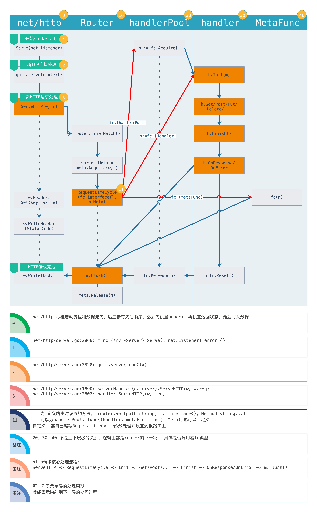

# OneBD

[TOC]

## 设计思路

## 路由

核心函数为注册和子路由

- SubRouter(prefix string) Router
    - prefix 匹配规则
        1. 形如 /abc/efd/:varA/*varB
        2. :会截取//之前作为变量内容，*匹配之后所有字符
        3. 优先级 字符>变量>通配 (/abc > /abc/edf > /abc/:varC > /abc/*varD > /:varA > /*varB)
- Set(prefix string, fc func() Handler, allowedMethods ...rfc.Method)
    - prefix 匹配规则同上
    - fc 生成新handler的方法，用于构建handler池，避免每次生成
    - allowedMethods 运行通过的http方法, 缺省则默认get

## 核心对象

- application

> 整体应用的全局配置和管理

- handler 

> 请求的周期管理

- handlerPool

> handler缓存池 避免每次去创建

- router

> 路由 根据请求路径匹配正确的handler去处理

- meta 

> 辅助handler处理request和response 

## TODO:

- content-type 中多种格式支持 

- 内置代理功能

- hook

- cache

- distribute

- websocket

- MQ

- auth

- 是否参考 fasthttp 继续优化net/http包相关,(可以实现 goroutine 池, 如 fasthttp 的workerPool机制)
  或者直接引用fasthttp

## 注意

- 本项目多次使用对象缓存和复用技术，谨慎使用衍生go程读取或修改原go程数据

## 更新

- 0.4.0 更新了路由组件，合并了trie和route对象

- 0.3.5 router 添加了对静态文件/目录的支持, meta 更新了write函数，删除了写缓冲

- 0.3.4 删除utils，log被独立出来成一个单独的模块，使各个组件之间更加解耦

- 0.3.3 比较了zero和zap性能数据(详细见doc)，改用 zerolog 作为日志

- 0.3.2 更新路由组件，更加解耦
    - Set 方法不限制设置请求处理方法， 可以是handlerPool， func()core.handler, func(core.Meta), 或其他自定义方法或动态类
    - 路由添加SetRequestCycle(func(interface(), core.Meta))方法， 可以自己注册请求周期管理函数，默认支持上述三种
    - 处理自由度极大提高，路由可以解耦使用，性能些微下降，处理单次路由平均时间上升50ns

- 0.3.0 更新路由算法，更改路由参数模式，路由性能提升6倍

- 0.2.0 更新路由匹配算法，添加url路径参数
    - 补充: 测试性能较差，详细数据见doc，考虑优化问题
        - 考虑参数多种类型支持是否有必要，尝试全部当成字符串变量处理
        - 尝试把路径查找树脱离出来，与路由树分离
        - 重用缓存，避免内存申请

- 0.1.5 完善路由基本功能

- 0.1.0 基本组件关系设计完成
